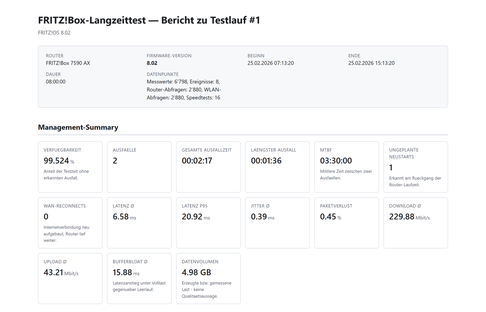
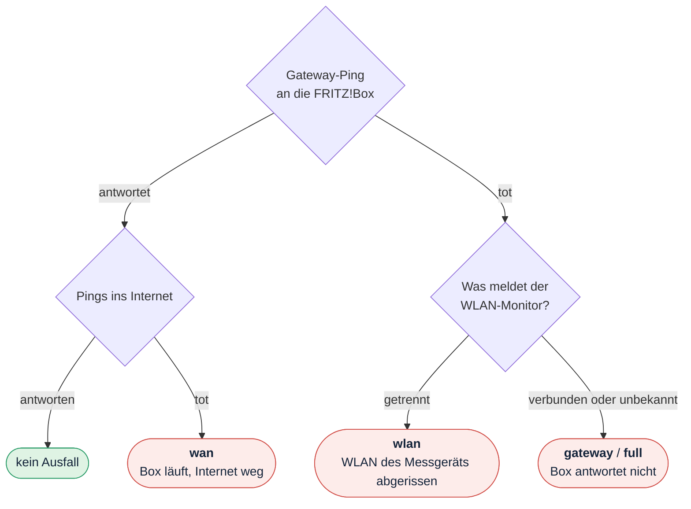
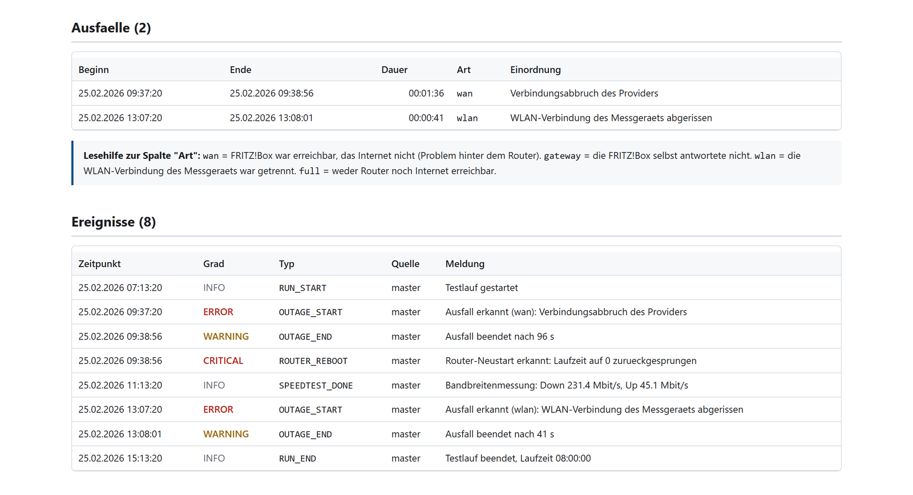
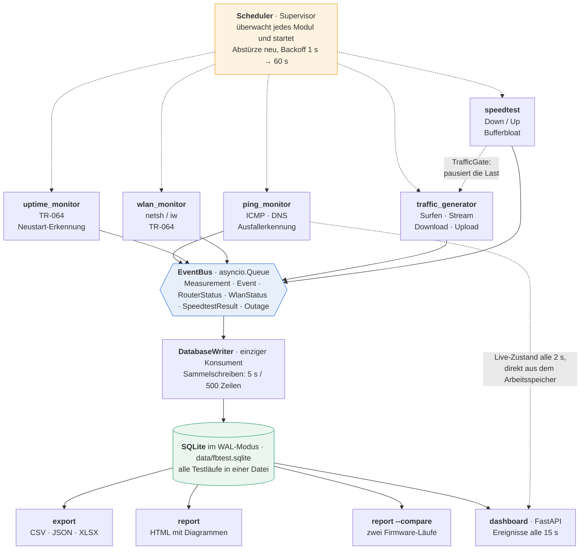
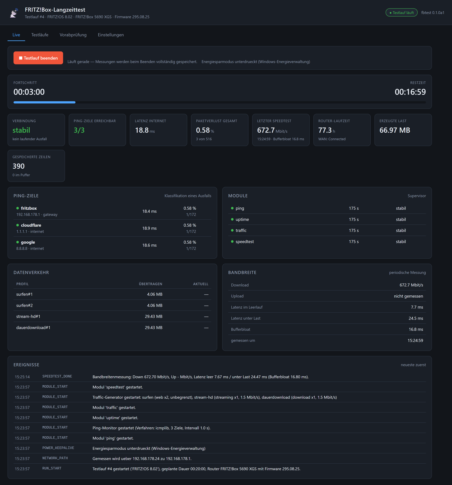
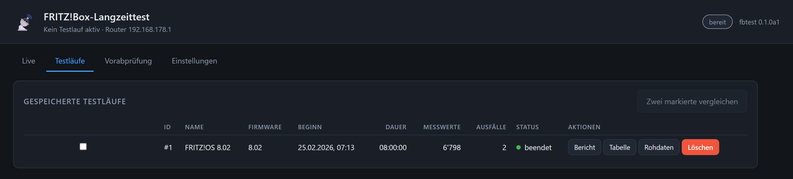
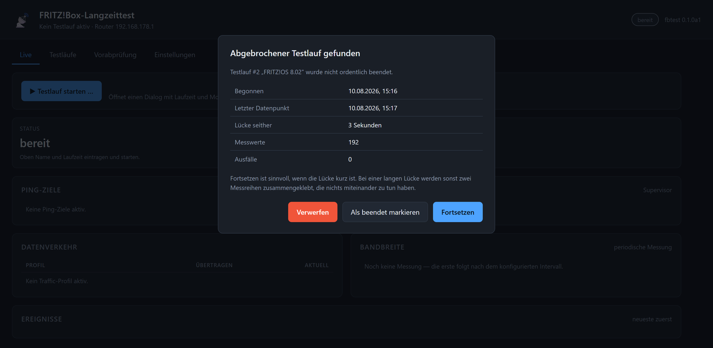
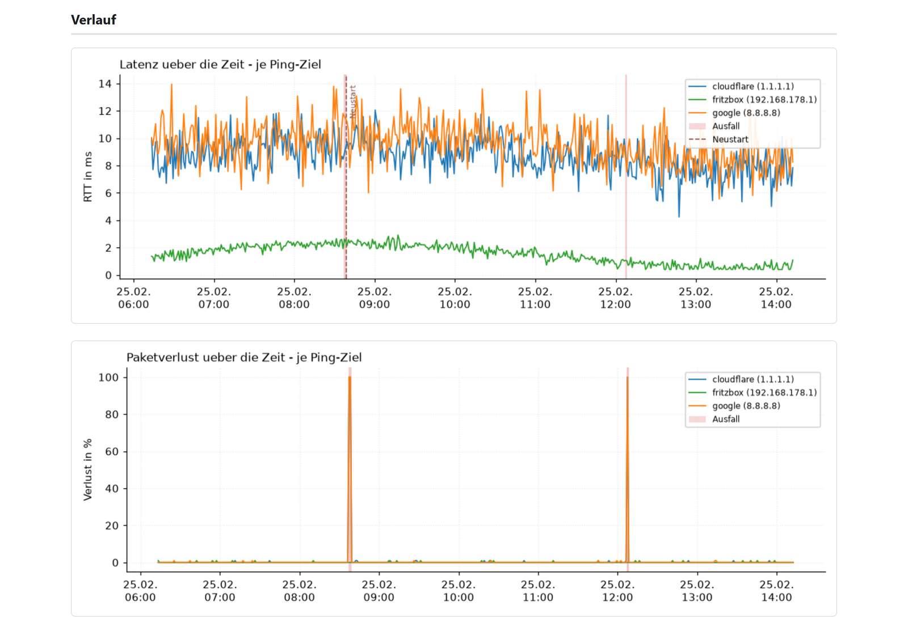

<div align="center">


**Version 0.1.0a1 (Alpha)** · Projektarbeit Informatiker EFZ, Fachrichtung Plattformentwicklung

</div>

Ein automatisiertes Testsystem, das die Stabilität einer FRITZ!Box über Stunden bis Tage
unbeaufsichtigt prüft: Es erzeugt LAN- und WLAN-Datenverkehr, überwacht permanent Erreichbarkeit
und Internetverbindung, erkennt Ausfälle sowie ungeplante Router-Neustarts, protokolliert alles
mit Zeitstempel und erstellt am Ende einen Testbericht.

**Zweck:** verschiedene Firmware-Versionen objektiv und reproduzierbar vergleichen.

<p align="center">
  
</p>
<p align="center">
  <sub>Das Ergebnis eines Laufs: eine einzelne HTML-Datei mit allen Kennzahlen.<br>
  Sämtliche Bericht-Abbildungen dieser Seite stammen aus einem <a href="#beispieldaten">erzeugten Beispiellauf</a>, nicht aus einem echten Netz.</sub>
</p>

---

## Inhalt

1. [Was das System kann](#was-das-system-kann)
2. [Architektur](#architektur)
3. [Installation](#installation)
4. [FRITZ!Box vorbereiten](#fritzbox-vorbereiten)
5. [Bedienung](#bedienung)
6. [Desktop-Anwendung](#desktop-anwendung)
7. [Web-Dashboard](#web-dashboard)
8. [Wie die Auswertung zu lesen ist](#wie-die-auswertung-zu-lesen-ist)
9. [Grenzen des Systems](#grenzen-des-systems)
10. [Entwicklung und Qualitätssicherung](#entwicklung-und-qualitätssicherung)
11. [Beispieldaten](#beispieldaten)
12. [Lizenz](#lizenz)

---

## Was das System kann

| Bereich | Was gemessen wird |
|---|---|
| **Erreichbarkeit** | Latenz, Jitter, Paketverlust je Ziel; getrennte DNS-Auflösungszeit |
| **Ausfälle** | Beginn, Ende, exakte Dauer – **und wo das Problem liegt** (WAN / Router / WLAN) |
| **Router-Telemetrie** | Laufzeit, WAN-Status, Sync-Raten, Byte-Zähler, Firmware-Version (TR-064) |
| **Neustarts** | ungeplante Router-Neustarts, getrennt von reinen WAN-Reconnects |
| **Last** | parallele Profile: Surfen, Streaming, Download, Upload, iperf3 – mit Ratenbegrenzung |
| **Bandbreite** | periodischer Speedtest inkl. **Bufferbloat** (Latenz unter Last vs. Leerlauf) |
| **WLAN** | Router-Sicht (Bänder, Clients, RSSI) und Client-Sicht (SSID, Band, Signal, Linkspeed) |
| **Bericht** | druckbarer HTML-Bericht mit Diagrammen, Ereignistabelle und **Firmware-Vergleich** |
| **Dashboard** | Live-Überwachung im Browser: Start/Stop, Kennzahlen, Ereignis-Ticker |

### Das Alleinstellungsmerkmal: Wo liegt das Problem?

Ein reines „Internet weg"-Protokoll ist wertlos, wenn man nicht weiß, *woran* es lag. Deshalb
klassifiziert das System jeden Ausfall:



| Klassifikation | Bedeutung | Erkannt an |
|---|---|---|
| `wan` | FRITZ!Box antwortet, Internet nicht | Gateway-Ping ok, Internet-Pings tot |
| `gateway` | FRITZ!Box selbst antwortet nicht | Gateway-Ping tot, lokale Verbindung besteht |
| `wlan` | WLAN des Messgeräts ist abgerissen | Gateway-Ping tot **und** WLAN-Monitor meldet „getrennt" |
| `full` | nichts erreichbar, keine lokale Ursache | alle Pings tot, WLAN-Zustand unauffällig oder unbekannt |

Im Bericht steht diese Einordnung direkt in der Ausfalltabelle – mitsamt einer Lesehilfe, damit
sie auch ohne diese Seite verständlich ist:

<p align="center">
  
</p>

Ebenso wichtig ist die Trennung **Router-Neustart vs. Verbindungsabbruch**: Die FRITZ!Box meldet
über TR-064 ihre eigene Laufzeit. Dieser Wert wächst monoton – *außer* die Box wurde neu
gestartet. Ein Rückgang ist damit ein direkter Beweis für einen Neustart, und der neue Wert
verrät sogar den Neustartzeitpunkt.

* Router-Laufzeit sinkt → `ROUTER_REBOOT` (das Gerät war weg)
* nur WAN-Laufzeit sinkt → `WAN_RECONNECT` (nur die Internetverbindung war weg)

Ein Router, der täglich neu startet, ist etwas anderes als einer, der nur seinen PPPoE-Tunnel
erneuert. Genau diese Unterscheidung macht Firmware-Vergleiche belastbar.

---

## Architektur

### Datenfluss



### Warum diese Struktur?

* **Module kennen einander nicht.** Sie legen Ergebnisse auf den Event-Bus und sind dadurch
  einzeln testbar und jederzeit neu startbar.
* **Genau ein Schreiber.** Der `DatabaseWriter` ist der einzige Konsument des Busses. Das macht
  Batch-Inserts möglich und vermeidet Sperrkonflikte in SQLite.
* **Auswertelogik getrennt vom Netzwerk.** `OutageTracker`, `UptimeTracker`, die Ping- und
  WLAN-Parser sowie die Aggregation enthalten keinerlei I/O. Deshalb laufen sämtliche Tests
  ohne echtes Netz und ohne FRITZ!Box.
* **Monotone Uhr für Dauern.** Zeitumstellung oder Standby verfälschen keine Ausfalldauer.
  Wall-Clock wird ausschließlich für Zeitstempel verwendet.

### Ordnerstruktur

```
Fritzbox_Test_APP/
├─ src/fbtest/
│  ├─ __main__.py            CLI (typer)
│  ├─ config.py              pydantic-Modelle, YAML laden/validieren
│  ├─ paths.py               Ressourcen- und Arbeitsverzeichnisse
│  ├─ context.py             Laufzeitkontext (Konfiguration + Pfade)
│  ├─ config_service.py      Formularwerte, Validierung, YAML-Schreiben
│  ├─ secrets_store.py       Passwort im Schlüsselspeicher des Systems
│  ├─ power.py               Standby-Unterdrückung während eines Laufs
│  ├─ network.py             Ermittlung des Standard-Gateways
│  ├─ desktop/                Fenster · Tray · Symbole · Meldungen · Einzelinstanz
│  ├─ runner.py              Orchestrierung eines Testlaufs
│  ├─ checks.py              Vorabprüfung (fbtest check)
│  ├─ logging_setup.py       rotierende Logdateien
│  ├─ core/                  models.py · events.py · scheduler.py · state.py
│  ├─ storage/               database.py · writer.py · exporter.py · workbook.py
│  ├─ modules/               base · ping_monitor · uptime_monitor ·
│  │                         traffic_generator · speedtest · wlan_monitor
│  ├─ router/fritzbox.py     TR-064-Wrapper, defensiv gekapselt
│  ├─ report/                generator.py · charts.py · templates/
│  ├─ dashboard/             app.py (FastAPI) · controller.py · static/
│  │                         static/: index.html · style.css · app.js ·
│  │                         settings.js · setup.js
│  └─ resources/             config.example.yaml (kommentierte Vorlage)
├─ packaging/                PyInstaller-Spec · Build-Skripte · Startvorbereitung
├─ tests/                    494 Tests, ohne Netzwerk lauffähig
├─ docs/EINSTELLUNGEN.md     Referenz aller Konfigurationsfelder (erzeugt)
├─ docs/bilder/              Abbildungen dieser Datei
├─ beispieldaten/            Exporte zweier Läufe zum Ausprobieren
├─ assets/                   erzeugte Symbole (gitignored)
├─ data/ exports/ reports/ logs/     (gitignored)
└─ pyproject.toml            ruff · mypy · pytest
```

---

## Installation

### Für Anwender: das fertige Programm

Kein Python, kein Terminal. Den Ordner `FRITZBox-Langzeittest` an einen beliebigen Ort kopieren
und **`FRITZBox-Langzeittest.exe` doppelklicken**. Beim ersten Start führt ein Assistent durch
die Einrichtung.

> **Windows blockiert den ersten Start.** Es erscheint „Der Computer wurde durch Windows
> geschützt". Das liegt daran, dass das Programm nicht mit einem gekauften Zertifikat signiert
> ist – nicht daran, dass etwas damit nicht stimmt. Auf **„Weitere Informationen"** klicken,
> dann auf **„Trotzdem ausführen"**. Nur beim ersten Mal nötig.

Konfiguration und Messdaten landen unter `%LOCALAPPDATA%\fbtest\`, nicht im Programmordner –
dieser liegt je nach Ablageort schreibgeschützt.

Unter **Linux** gibt es kein natives Fenster (Begründung unter [Grenzen des
Systems](#grenzen-des-systems)); das Programm öffnet stattdessen ein Browserfenster im
App-Modus. `packaging/build.sh` legt eine `fbtest.desktop` an, die sich ins Anwendungsmenü
kopieren lässt.

### Für Entwickler: aus dem Quellcode

Voraussetzung: **Python 3.14** (Windows 11 oder Linux). Sonst nichts – kein npm, kein
Compiler, keine Systempakete.

**Windows:**

```powershell
git clone https://github.com/Dinosaurier-io/FritzBox_Tester.git
cd FritzBox_Tester
.\setup.ps1
```

**Linux** (z. B. Raspberry Pi):

```bash
git clone https://github.com/Dinosaurier-io/FritzBox_Tester.git
cd FritzBox_Tester
./setup.sh
```

#### Ohne `git`

Auf der Projektseite **Code → Download ZIP**, entpacken, dann im entstandenen Ordner
`FritzBox_Tester-main` die Datei **`setup.bat` doppelklicken**. Fertig.

Diese Datei gibt es aus einem konkreten Grund: Windows markiert alles, was aus dem Internet
kommt, und weigert sich dann, `setup.ps1` auszuführen („ist nicht digital signiert"). Das
liegt an der Ausführungsrichtlinie, nicht am Skript. `setup.bat` unterliegt dieser Sperre
nicht, hebt die Markierung an allen Dateien auf und startet danach die eigentliche
Einrichtung. Optionen funktionieren auch hier: `setup.bat --minimal`, `setup.bat --no-test`.

Unter Linux entsprechend: **Code → Download ZIP**, dann

```bash
unzip FritzBox_Tester-main.zip && cd FritzBox_Tester-main
chmod +x setup.sh && ./setup.sh
```

Der einzige Nachteil ohne `git`: Für ein Update muss das ZIP neu heruntergeladen werden, ein
`git pull` genügt dann nicht. Wer `git` doch möchte:

```powershell
winget install Git.Git      # Windows, danach Terminal neu öffnen
```
```bash
sudo apt install git        # Debian, Ubuntu, Raspberry Pi OS
```

Das Skript sucht ein passendes Python, legt `.venv` an, installiert alle Abhängigkeiten,
bindet das Projekt ein, prüft jedes Paket auf Importierbarkeit und lässt zum Schluss die
Testsuite laufen. Es arbeitet nur mit Pfaden relativ zu sich selbst – der Ablageort und der
Benutzername spielen keine Rolle. Ein erneuter Aufruf ist unschädlich: Eine vorhandene `.venv`
wird weiterverwendet.

| Option | Wirkung |
|---|---|
| `-Minimal` / `--minimal` | nur Laufzeitabhängigkeiten, ohne pytest, ruff, mypy und PyInstaller |
| `-NoTest` / `--no-test` | überspringt die Testsuite am Ende |

<details>
<summary>Lieber von Hand</summary>

```powershell
python -m venv .venv
.\.venv\Scripts\Activate.ps1
pip install -r requirements-dev.txt
pip install -e .                 # macht die Befehle "fbtest" und "fbtest-app" verfügbar
```

```bash
python3 -m venv .venv && source .venv/bin/activate
pip install -r requirements-dev.txt && pip install -e .
```

`requirements.txt` genügt, wenn nur ausgeführt und nicht entwickelt wird.

</details>

Danach wahlweise `fbtest app` (Fenster), `fbtest dashboard` (Browser) oder die
[Kommandozeile](#bedienung). Beim ersten Start legt `fbtest init` die Ordnerstruktur und eine
kommentierte `config.yaml` an.

> **Das Passwort der FRITZ!Box gehört nicht in die `config.yaml`.** Reihenfolge der Quellen:
> Umgebungsvariable `FRITZ_PASSWORD` → Schlüsselspeicher des Betriebssystems → (Notnagel)
> Klartext. Am bequemsten ist das Einstellungsformular im Fenster, das schreibt in den
> Schlüsselspeicher.

### Programmpaket selbst bauen

```powershell
.\packaging\build.ps1            # Windows
```
```bash
./packaging/build.sh             # Linux
```

Beide Skripte führen zuerst Tests, `ruff` und `mypy` aus und brechen bei Problemen ab – ein
Paket aus fehlerhaftem Stand soll gar nicht erst entstehen. Ergebnis:
`dist/FRITZBox-Langzeittest/` mit rund 120 MB.

Anschliessend vergleichen sie die Prüfsummen der mitgelieferten Oberflächendateien mit dem
Quellstand. Grund: Ein Neubau ohne `--clean` übernimmt unter Umständen die zwischengespeicherte
alte Fassung. Der Fehler ist besonders tückisch, weil er wie eine wirkungslose Korrektur
aussieht – man sucht dann im Quelltext statt im Bauvorgang.

Darin liegen **zwei** Programme, die sich die Bibliotheken teilen:

| Datei | Zweck |
|---|---|
| `FRITZBox-Langzeittest.exe` | Fenster und Infobereich, ohne Konsole – zum Doppelklicken |
| `fbtest.exe` | die vollständige Kommandozeile, für Automatisierung |

### Ohne Administratorrechte

Für präzise ICMP-Messungen braucht `icmplib` Rohsockets. Fehlen die Rechte, schaltet das System
**automatisch** auf das System-Kommando `ping` um und vermerkt das im Log und im Bericht – der
Testlauf funktioniert also in jedem Fall, nur mit etwas gröberer Latenzauflösung.

Optional unter Linux: `sudo setcap cap_net_raw+ep $(readlink -f .venv/bin/python)`

---

## FRITZ!Box vorbereiten

Ohne diese Schritte läuft das System im **eingeschränkten Betrieb**: Ping, Traffic und Speedtest
funktionieren, aber Router-Laufzeit, Firmware-Version und die Neustart-Erkennung fehlen.

### 1. TR-064 aktivieren

> Heimnetz → Netzwerk → Netzwerkeinstellungen → **„Zugriff für Anwendungen zulassen"** aktivieren

### 2. Benutzer anlegen

> System → FRITZ!Box-Benutzer → Benutzer hinzufügen

Der Benutzer braucht mindestens die Berechtigung *„FRITZ!Box Einstellungen"*.

### 3. Passwort setzen – nicht in der Datei

Das Passwort wird aus drei Quellen ermittelt, die erste gefundene gewinnt:

| # | Quelle | Wofür gedacht |
|---|--------|---------------|
| 1 | Umgebungsvariable `FRITZ_PASSWORD` | Automatisierung, CI, Server ohne Sitzung |
| 2 | **Schlüsselspeicher des Betriebssystems** | der normale Weg |
| 3 | Klartext in der `config.yaml` | letzter Ausweg |

Der Schlüsselspeicher ist der Windows-Anmeldeinformationsspeicher bzw. GNOME Keyring oder
KWallet unter Linux. Gesetzt wird er in der Anwendung; auf der Kommandozeile bleibt die
Umgebungsvariable der Weg:

```powershell
$env:FRITZ_PASSWORD = 'dein-passwort'          # PowerShell, gilt für diese Sitzung
```
```bash
export FRITZ_PASSWORD='dein-passwort'          # Linux
```

Die Umgebungsvariable behält bewusst den Vorrang: Wer sie ausdrücklich setzt, meint sie auch –
und auf einem Server ohne grafische Sitzung gibt es gar keinen Schlüsselspeicher.

Die `config.yaml` enthält nur den *Namen* der Umgebungsvariablen. Sie ist zusätzlich per
`.gitignore` vom Repository ausgeschlossen, und der Konfigurations-Snapshot in der Datenbank
maskiert das Passwort.

### 4. Nur für den Bandwechsel-Test: getrennte SSIDs

> WLAN → Funknetz → **„Gleicher Name für 2,4- und 5-GHz-Frequenzband"** abwählen

Anschließend beide Netze einmal manuell verbinden, damit die Profile im Betriebssystem
existieren. Siehe [Grenzen des Systems](#grenzen-des-systems).

---

## Wo liegen Konfiguration und Daten?

Das Programm sucht seinen Arbeitsordner in dieser Reihenfolge – die erste zutreffende
Regel gewinnt:

| # | Regel | Ergebnis |
|---|-------|----------|
| 1 | `--config <pfad>` angegeben | der Ordner dieser Datei |
| 2 | Umgebungsvariable `FBTEST_HOME` gesetzt | dieser Ordner |
| 3 | im Arbeitsverzeichnis liegt eine `config.yaml` | Arbeitsverzeichnis |
| 4 | Arbeitsverzeichnis ist der Projektordner (nur aus dem Quellcode) | Projektordner |
| 5 | sonst | `%LOCALAPPDATA%\fbtest\` bzw. `~/.config/fbtest/` + `~/.local/share/fbtest/` |

**Regel 3 ist die wichtigste.** Sie sorgt dafür, dass eine bestehende Installation mit
ihrer Datenbank weiterarbeitet – wer bisher im Projektordner gearbeitet hat, merkt von
den übrigen Regeln nichts.

Regel 5 existiert für die spätere gebündelte Anwendung: Dort liegt das Programm in einem
schreibgeschützten Verzeichnis, `data/` daneben anzulegen würde fehlschlagen.

Welche Regel gegriffen hat, zeigt `fbtest init` in der ersten Zeile an. Bei einem
Konfigurationsfehler wird der gesuchte Pfad ebenfalls mit ausgegeben – sonst bliebe
unklar, welche Datei überhaupt gemeint war.

---

## Bedienung

```
fbtest init                              Ordner + kommentierte config.yaml anlegen
fbtest check                             Vorabprüfung: Box, TR-064, Ziele, Server, WLAN
fbtest run [--duration 24h] [--name ...] Testlauf starten
fbtest list                              alle Testläufe mit Kennzahlen
fbtest export <id> --format xlsx|csv|json|both|all
fbtest report <id>                       HTML-Bericht
fbtest report --compare <a> <b>          zwei Firmware-Läufe gegenüberstellen
fbtest dashboard [--port 8080]           Web-Oberfläche zur Live-Überwachung
fbtest app                               Desktop-Anwendung (Fenster + Infobereich)
```

### Typischer Ablauf

```powershell
fbtest init                                        # einmalig
notepad config.yaml                                # IP, Benutzer, Ping-Ziele anpassen
$env:FRITZ_PASSWORD = 'geheim'

fbtest check                                       # muss grün sein, bevor es losgeht
fbtest run --duration 24h --name "FRITZ!OS 8.00"

# ... Firmware aktualisieren, dann identisch messen ...
fbtest run --duration 24h --name "FRITZ!OS 8.02"

fbtest report --compare 1 2                        # der eigentliche Vergleich
```

Wichtig: **Beide Läufe mit identischer Konfiguration und gleicher Dauer messen.** Sonst
vergleicht man nicht Firmware-Versionen, sondern Messbedingungen.

### Während des Laufs

`fbtest run` zeigt eine Live-Statusanzeige mit Restlaufzeit, Modulzustand, Neustartzähler und
Schreibpuffer. Mit `--no-live` erscheint stattdessen der Logstrom (praktisch für Protokolle und
Screenshots).

**Strg+C** beendet geordnet: laufende Tasks werden abgebrochen, der Puffer wird geschrieben und
`ended_at` gesetzt. Ein hart abgebrochener Lauf (Stromausfall) wird beim nächsten Start erkannt
und auf Wunsch fortgesetzt; die Lücke erscheint als Ereignis `SYSTEM_GAP`.

### Energiesparen: das erledigt das Tool selbst

Ein Test über 24 oder 72 Stunden ist wertlos, wenn der Rechner nach 30 Minuten in den Standby
geht. Deshalb unterdrückt `fbtest` den Energiesparmodus für die Dauer des Testlaufs – unter
Windows über die Energieverwaltung, unter Linux über `systemd-inhibit`. Der Bildschirm darf
dabei bewusst ausgehen; er wird für die Messung nicht gebraucht.

Die Statuszeile im Terminal und im Dashboard zeigt an, ob es geklappt hat. Ein Fehlschlag
bricht den Lauf **nicht** ab (lieber ein Test mit Standby-Risiko als gar keiner), wird aber als
Ereignis `POWER_KEEPALIVE` festgehalten – bei einer späteren Messlücke ist damit nachvollziehbar,
ob der Rechner überhaupt schlafen gehen konnte.

Abschaltbar über `run.prevent_standby: false`. Dann gilt wieder: von Hand einstellen unter
*Einstellungen → System → Netzbetrieb & Energiesparen*. Standby-Lücken erkennt das Tool
ohnehin (`SYSTEM_GAP`) und wertet sie ausdrücklich **nicht** als Router-Ausfall – gemessen wird
in dieser Zeit aber nichts.

---

## Desktop-Anwendung

`fbtest app` bzw. `FRITZBox-Langzeittest.exe` öffnet dieselbe Oberfläche in einem eigenen
Fenster – ohne Adressleiste, mit Symbol im Infobereich.

### Fenster schliessen bricht keinen Testlauf ab

Das ist die wichtigste Regel der ganzen Schale. Ein versehentlicher Klick auf das Kreuz darf
keine Messung von 72 Stunden vernichten. Bei einem laufenden Testlauf wird das Fenster deshalb
**nur versteckt**; die Messung läuft im Hintergrund weiter, und eine Systemmeldung sagt genau
das. Beendet wird ausschliesslich über *Programm beenden* im Kontextmenü des Symbols – und
selbst dort werden vorher noch alle gepufferten Messwerte geschrieben.

### Symbol im Infobereich

Der eigentliche Zweck ist nicht Bequemlichkeit, sondern Sichtbarkeit: Ein Lauf über Tage hat
kein Fenster im Vordergrund. Das Symbol ist der einzige Ort, an dem durchgehend erkennbar
bleibt, dass gemessen wird – und ob gerade etwas nicht stimmt.

| Farbe | Bedeutung |
|---|---|
| blau | bereit, kein Testlauf |
| grün | Testlauf läuft |
| rot | Ausfall aktiv |

Kontextmenü: *Öffnen*, *Testlauf beenden* (ausgegraut, wenn keiner läuft), *Programm beenden*.

### Systemmeldungen

Bewusst sparsam – eine Meldung, die zu oft kommt, wird weggeklickt und dann auch dann übersehen,
wenn sie wichtig ist:

* **Router-Neustart** – immer. Das ist der Befund, auf den der ganze Test zielt.
* **Ausfall** – erst ab `desktop.notify_outage_after_s` (Vorgabe 60 s) und dann **während** er
  andauert, nicht erst am Ende. Sonst erführe man von einem stundenlangen Ausfall erst, wenn er
  vorbei ist. Ein Aussetzer von drei Sekunden ist ein Messwert, kein Weckruf.
* **Ende des Testlaufs** – einmal, mit Ergebnis.

Abschaltbar über `desktop.notifications: false`.

### Nur eine Instanz

Zwei parallele Testläufe auf demselben Gerät teilen sich Netzwerkkarte und Bandbreite – beide
Messreihen wären unbrauchbar. Ein zweiter Start holt deshalb das bestehende Fenster nach vorn,
statt ein weiteres zu öffnen.

Die Sperre ist eine belegte TCP-Verbindung auf der Loopback-Schnittstelle, keine Sperrdatei:
Stürzt das Programm ab, bleibt eine Datei liegen und die Anwendung liesse sich nie wieder
starten. Ein Port dagegen wird vom Betriebssystem automatisch frei.

---

## Web-Dashboard

```powershell
fbtest dashboard
```

Öffnet automatisch <http://127.0.0.1:8080>. Port und Adresse lassen sich mit `--port` und
`--host` überschreiben, `--no-open` unterdrückt das automatische Öffnen des Browsers.

Für die Beobachtung eines mehrtägigen Laufs ist das Dashboard deutlich angenehmer als das
Terminal: Der Browser darf jederzeit geschlossen und wieder geöffnet werden, ohne dass die
Messung etwas davon merkt.

<p align="center">
  
</p>
<p align="center">
  <sub>Der Reiter <em>Live</em> während eines laufenden Tests.</sub>
</p>

### Was das Dashboard zeigt

| Reiter | Inhalt |
|---|---|
| **Live** | Fortschritt und Restzeit, Kennzahlen-Kacheln, Zustand jedes Ping-Ziels und jedes Moduls, Datenverkehr, Bandbreite, Ereignis-Ticker |
| **Testläufe** | alle gespeicherten Läufe; Bericht, Tabelle, Rohdaten, Abschliessen und Löschen je Lauf, zwei markierte Läufe direkt vergleichen |
| **Vorabprüfung** | dieselben Prüfungen wie `fbtest check`, mit einem Klick |
| **Einstellungen** | Konfiguration als Formular, Rohansicht, Passwort, Diagnose |

<p align="center">
  
</p>

Ein Testlauf lässt sich hier auch **starten und beenden**. Der Lauf läuft im
Dashboard-Prozess; „Testlauf beenden" wirkt exakt wie Strg+C auf der Kommandozeile —
die Module werden geordnet gestoppt und der Schreibpuffer vollständig gespeichert.

### Beim ersten Start: der Einrichtungsassistent

Existiert noch keine `config.yaml`, **startet das Dashboard trotzdem** und führt in vier
Schritten durch die Einrichtung: Willkommen → FRITZ!Box → Ping-Ziele → Prüfung.

Das ist keine Nebensache, sondern die Voraussetzung dafür, dass es den Assistenten geben kann:
Ein Programm, das sich nur einrichten lässt, wenn es bereits eingerichtet ist, wäre nutzlos.
Bis zum ersten Speichern arbeitet die Anwendung mit der mitgelieferten Vorlage im Speicher.

Die **IP-Adresse der FRITZ!Box wird automatisch vorgeschlagen** – ermittelt aus dem
Standard-Gateway dieses Rechners, also dem Router, über den er tatsächlich ins Internet geht.
Die Werksadresse `192.168.178.1` zu raten stimmt meistens, aber eben nur meistens; in einem
geänderten Adressbereich oder hinter einem zweiten Router führt sie ins Leere, und man sucht
den Fehler an der falschen Stelle.

Der Assistent fragt bewusst nur drei Dinge ab (Adresse, Benutzername, Passwort) plus die
Ping-Ziele. Alles Übrige kommt aus der Vorlage. Ein Assistent, der sechzig Konfigurationswerte
abfragt, wird abgebrochen – und dann ist gar nichts eingerichtet.

Am Ende läuft automatisch die Vorabprüfung mit Auswertung im Klartext.

Auf der **Kommandozeile** bleibt es beim harten Fehler, wenn die Konfiguration fehlt: Wer
`fbtest run` aufruft, will einen Testlauf und keine stillschweigend erfundene Konfiguration.
Dort legt `fbtest init` die Datei an.

### Einstellungen ohne Texteditor

> 📖 **[Referenz aller Einstellungen →](docs/EINSTELLUNGEN.md)** – jedes Feld der
> `config.yaml` mit Typ, Wertebereich, Standardwert und Bedeutung. Ebenfalls aus den
> Modellen erzeugt, kann also nicht veralten.

Das Formular wird **aus dem JSON-Schema der pydantic-Modelle erzeugt**, nicht von Hand
gepflegt. Kommt in der Konfiguration ein Feld dazu, erscheint es hier automatisch mit
Beschriftung, Beschreibung und Wertebereich. Eine handgeschriebene Maske wäre spätestens beim
dritten neuen Feld veraltet – und niemand merkt es.

Über hundert Felder in zehn Abschnitten sind untereinander allerdings nicht zu überblicken.
Die Maske ist deshalb **zweigeteilt**: links ein Menü der Abschnitte, rechts nur der gewählte.
Dazu kommen vier Hilfen, die alle dasselbe Ziel haben – den gesuchten Wert schnell finden und
seine Bedeutung erkennen:

| | |
|---|---|
| **Suche** | filtert alle Abschnitte gleichzeitig nach Name, Beschreibung oder Pfad (`ping.interval`); das Menü zeigt die Trefferzahl je Abschnitt |
| **Dauern mit Einheit** | `30 Minuten` statt `1800.0`; die Einheit ist umschaltbar, gespeichert werden weiterhin Sekunden |
| **Abweichungen** | Felder, die vom Auslieferungsstandard abweichen, sind mit `≠` markiert und einzeln zurücksetzbar; ein Filter blendet alle übrigen aus |
| **Offene Änderungen** | werden gezählt und am Feld markiert – und beim Reiterwechsel nicht mehr stillschweigend verworfen |

Validierungsfehler stehen **am verursachenden Feld**, nicht als Sammelmeldung oben; liegt das
Feld in einem anderen Abschnitt, springt die Maske dorthin. Wird etwas abgelehnt, bleibt die
Datei unangetastet; vor jedem Schreiben entsteht eine `config.yaml.bak`.

Für Fortgeschrittene gibt es die **Rohansicht** – die Datei im Original, mit Prüfung vor dem
Speichern. Neue Traffic-Profile entstehen dort, weil deren Felder vom Profiltyp abhängen; im
Formular lassen sich vorhandene Profile bearbeiten und entfernen.

Der **Diagnosebereich** beantwortet die Fragen, die bei einer Fehlersuche zuerst kommen: Wo
liegen Konfiguration und Datenbank, welche Pfadregel hat gegriffen, womit wird gemessen
(icmplib oder System-`ping` – mit Erklärung, falls die Rohsocket-Rechte fehlen), welcher
Schlüsselspeicher wird benutzt, wird der Energiesparmodus unterdrückt.

### Start- und Wiederaufnahme-Dialog

„Testlauf starten" öffnet einen Dialog mit Laufzeit-Vorgaben (1 h / 8 h / 24 h / 72 h oder
frei), einer Übersicht der aktiven Module und einer automatischen Vorabprüfung. Warnungen
blockieren bewusst **nicht** – ein Lauf ohne TR-064 ist immer noch ein brauchbarer Lauf.
Fehler dagegen schon.

Liegt beim Start ein **abgebrochener Testlauf** vor (Absturz, Stromausfall), erscheint ein
Dialog mit den Zahlen, die für die Entscheidung nötig sind – Messwerte, Ausfälle und vor allem
die Länge der Lücke – und den drei Möglichkeiten *fortsetzen*, *als beendet markieren*,
*verwerfen*. Stillschweigendes Fortsetzen wäre falsch, wenn zwischen Absturz und Neustart Tage
liegen: Dann klebt man zwei Messreihen zusammen, die nichts miteinander zu tun haben.

<p align="center">
  
</p>

### Zwei Datenquellen, zwei Takte

Das ist die zentrale Entwurfsentscheidung der Oberfläche:

* **Live-Zustand** (alle 2 s) kommt direkt aus den Modulinstanzen im Arbeitsspeicher.
  Er ist damit sekundenaktuell — unabhängig davon, dass der Ping-Monitor seine Werte nur
  einmal pro Aggregationsfenster (Standard 60 s) in die Datenbank schreibt.
* **Ereignisse** (alle 15 s) kommen aus der Datenbank. Weil SQLite im WAL-Modus läuft,
  stört das Lesen den laufenden Schreibvorgang nicht.

Ohne diese Trennung würde die Live-Anzeige nur einmal pro Minute zucken — die Latenz je
Ping-Ziel stünde eine Minute lang unverändert da, obwohl die Messung längst weitergelaufen ist.

**Kurvenverläufe zeigt ausschliesslich der Bericht.** Während eines Laufs bestünde eine Kurve
aus wenigen Punkten in einem Zeitfenster, das grösstenteils leer ist — sie beantwortet keine
Frage, verdrängt aber den aktuellen Zustand aus dem Bild. Der Bericht hat den ganzen Lauf und
kann Ausfälle und Neustarts zusätzlich im Diagramm markieren.

### Kein CDN, kein npm

Die Oberfläche ist handgeschriebenes HTML/CSS/JS ohne Build-Schritt und ohne externe
Ressourcen — fünf Dateien in `dashboard/static/`, keine Bibliothek. Die Diagramme des
Berichts entstehen serverseitig mit matplotlib und werden als Base64 eingebettet; der
Browser lädt dafür nichts nach.

Der Grund ist nicht Purismus: Ein Werkzeug, das Internetausfälle misst, darf zur Anzeige
seiner Messwerte kein Internet benötigen. Ein Test in der Testsuite stellt sicher, dass sich
nie versehentlich eine externe URL einschleicht — ein zweiter, dass keine Datei mitgeliefert
wird, die niemand mehr einbindet.

### Sicherheitshinweis

Das Dashboard lauscht standardmäßig nur auf `127.0.0.1`. Das allein genügt nicht: Eine
beliebige Webseite in demselben Browser kann per JavaScript Anfragen an `127.0.0.1` schicken
und damit einen mehrtägigen Testlauf abbrechen oder die Konfiguration auslesen.

Deshalb erzeugt jeder Programmstart ein **Sitzungs-Token**. Es wird beim Ausliefern in die
Seite eingesetzt, und jede API-Anfrage muss es mitführen. Fremde Seiten kommen wegen der
Same-Origin-Policy nicht an den Wert heran. Bewusst kein Cookie – ein Cookie würde der
Browser auch bei Anfragen fremder Seiten mitsenden und den Schutz aufheben.

Eine **Benutzeranmeldung ist das nicht**. Wer das Dashboard mit `--host 0.0.0.0` im Netz
freigibt, macht es für jeden zugänglich, der die Seite einmal geladen hat. Für den Zugriff
von unterwegs besser einen SSH-Tunnel verwenden.

---

## Wie die Auswertung zu lesen ist

Der Bericht ist eine **einzige HTML-Datei**; alle Diagramme sind als Base64 eingebettet. Er lässt
sich weitergeben, archivieren und direkt aus dem Browser drucken (eigene Druckstile enthalten).

Die Diagramme markieren Ausfälle als Fläche und Router-Neustarts als senkrechte Linie. Damit ist
auf einen Blick erkennbar, ob ein Latenzanstieg zufällig war oder mit einem Ereignis zusammenfällt:

<p align="center">
  
</p>

| Kennzahl | Bedeutung | Richtung |
|---|---|---|
| Verfügbarkeit | Anteil der Testzeit ohne erkannten Ausfall | höher = besser |
| Ausfälle / längster Ausfall | Anzahl und Maximaldauer | kleiner = besser |
| MTBF | mittlere Zeit zwischen zwei Ausfällen | höher = besser |
| Ungeplante Neustarts | am Laufzeit-Rückgang erkannt | kleiner = besser |
| WAN-Reconnects | Verbindung neu aufgebaut, Router lief weiter | kleiner = besser |
| Latenz Ø / p95, Jitter | Reaktionszeit und deren Schwankung | kleiner = besser |
| Paketverlust | Anteil verlorener Pings | kleiner = besser |
| Download/Upload Ø | Bandbreite aus dem eigenen Speedtest | höher = besser |
| **Bufferbloat Ø** | Latenzanstieg unter Volllast | kleiner = besser |
| Datenvolumen | erzeugte Last | ohne Wertung |

**Bufferbloat verdient besondere Beachtung.** Zwei Firmware-Versionen können identische
Bandbreite liefern, sich unter Last aber völlig unterschiedlich verhalten. Steigt die Latenz von
10 ms auf 300 ms, sobald jemand etwas herunterlädt, ist der Anschluss für Videotelefonie oder
Spiele unbrauchbar – obwohl der Speedtest „gut" aussieht.

Der Vergleichsmodus bewertet jede Kennzahl richtungsbewusst („B ist besser / schlechter") und
normiert die Overlay-Diagramme auf den jeweiligen Laufbeginn, damit unterschiedliche Startzeiten
die Kurven nicht gegeneinander verschieben. Sind die Läufe unterschiedlich lang, weist der
Bericht ausdrücklich darauf hin, dass absolute Zählwerte dann nur eingeschränkt vergleichbar sind.

---

## Grenzen des Systems

Bewusst offen dokumentiert statt mit Platzhalterwerten kaschiert.

### Nicht in der Alpha enthalten

| Funktion | Status | Ersatz bis dahin |
|---|---|---|
| **Agent-Modus** (`fbtest agent`) | nicht implementiert | Auf jedem Gerät einen eigenen Testlauf starten und die Berichte nebeneinander legen. |
| **PDF-Export** (`--pdf`) | nicht implementiert | HTML-Bericht im Browser mit „Als PDF drucken" – die Druckstile sind darauf ausgelegt. |

`fbtest agent` existiert und gibt eine klare Meldung aus, statt kommentarlos zu scheitern.

Das Dashboard zeigt außerdem immer nur **einen** Testlauf gleichzeitig — zwei parallele Läufe
auf demselben Gerät würden sich gegenseitig die Messung verfälschen. Die Desktop-Anwendung
erzwingt das mit einer Einzelinstanz-Sperre; ein zweiter Start holt das bestehende Fenster nach
vorn, statt ein weiteres zu öffnen.

| Einschränkung | Status | Hintergrund |
|---|---|---|
| **Natives Fenster unter Linux** | nicht enthalten | `pywebview` braucht dort systemweit installierte GTK- und WebKit-Bibliotheken. Sie lassen sich nicht verlässlich mitliefern; ein Paket, das auf einer Distribution läuft und auf der nächsten nicht startet, wäre schlechter als keines. Stattdessen öffnet sich ein Browserfenster im App-Modus. |
| **Signiertes Programm** | nicht enthalten | Ein Zertifikat für Code Signing ist kostenpflichtig. Ohne es zeigt Windows beim ersten Start eine SmartScreen-Warnung (siehe [Installation](#für-anwender-das-fertige-programm)). |

### Technische Einschränkungen

* **Ein WLAN-Adapter = ein Client.** Ein Laptop kann sich nicht gleichzeitig mit mehreren
  WLAN-Bändern verbinden. Mehrere gleichzeitige WLAN-Clients erfordern den Agent-Modus.
* **Bandwechsel-Test braucht getrennte SSIDs.** Bei aktivem Band-Steering (FRITZ!Box-Standard:
  gleiche SSID für 2,4 und 5 GHz) entscheidet die Box, auf welchem Band ein Client landet. Eine
  gezielte Bandwahl ist dann technisch unmöglich – nicht eine Frage der Implementierung.
* **RSSI unter Windows ist eine Näherung.** `netsh` liefert nur eine Signalqualität in Prozent.
  Die Umrechnung `dBm = Prozent/2 − 100` folgt der Microsoft-Skala, ist aber kein echter
  Messwert. Unter Linux liefert `iw` echte dBm. Betroffene Werte sind im Bericht markiert.
* **6-GHz-Kanalnummern überschneiden sich mit 2,4 GHz.** Ohne Frequenzangabe (Windows liefert
  keine) ist die Bandzuordnung dort nicht eindeutig.
* **Der Speedtest ist kein offizieller Speedtest.** Er lädt immer dieselbe Datei über dieselbe
  Anzahl Verbindungen. Das ist bewusst so: Fremde Dienste wählen wechselnde Server, was
  Ergebnisse über Tage hinweg unvergleichbar macht. Für den *Vergleich zweier Läufe* ist dieses
  Verfahren besser geeignet, für eine Aussage über die absolute Anschlussgeschwindigkeit
  schlechter.
* **32-Bit-Byte-Zähler.** Ältere FRITZ!OS-Versionen liefern nur 32-Bit-Zähler, die nach 4 GB
  überlaufen. Das System nutzt bevorzugt die 64-Bit-Variante; erkennt es einen Rücksprung,
  verwirft es das Intervall, statt einen Unsinnswert zu speichern.
* **ICMP wird nicht überall beantwortet.** Manche Hosts ignorieren Pings grundsätzlich. Solche
  Ziele erzeugen Dauerausfälle – `fbtest check` warnt davor.
* **Das Tool ändert nichts an der FRITZ!Box.** Es ist ein Mess-, kein Steuerwerkzeug. Neustarts
  müssen manuell ausgelöst werden; entsprechend zählt das System alle erkannten Neustarts als
  ungeplant (die Unterscheidung ist im Code vorbereitet).

---

## Entwicklung und Qualitätssicherung

```powershell
pip install -r requirements-dev.txt

.\.venv\Scripts\python.exe -m pytest              # 494 Tests, ohne Netzwerk
.\.venv\Scripts\python.exe -m ruff check .        # Linting
.\.venv\Scripts\python.exe -m mypy                # Typprüfung (strict für core/ und storage/)
```

Aktueller Stand: **494 Tests grün, ruff ohne Befund, mypy ohne Befund.**

Getestet werden gezielt die Stellen, an denen Fehler teuer wären:

| Testdatei | Prüft |
|---|---|
| `test_ping_analysis.py` | `ping`-Ausgabe-Parser (deutsch/englisch, `Zeit<1ms`, „Zielhost nicht erreichbar" trotz Exitcode 0), Aggregation, Perzentil, Jitter, **Ausfallerkennung und -klassifikation** |
| `test_uptime_tracker.py` | **Neustart-Erkennung** über Uptime-Sprünge, Trennung Reboot/Reconnect, Statuswechsel, Verfügbarkeit, MTBF |
| `test_wlan_parsers.py` | `netsh`- und `iw`-Parser mit originalgetreuen Fixtures inkl. Umlauten und Dezimalkomma |
| `test_config.py` | Validierung, Dauerangaben, Passwortauflösung, Maskierung im Snapshot, Gültigkeit der ausgelieferten Beispielkonfiguration |
| `test_storage.py` | Schema, WAL, doppelte Zeitstempel, Batch-Inserts, Crash-Recovery, Export |
| `test_core.py` | Event-Bus (inkl. Überlauf), Token-Bucket, **Scheduler-Neustartverhalten**, Berichtsauswertung und Vergleichsbewertung |
| `test_dashboard.py` | Dashboard-API: Statusendpunkt, Zeitreihen-Gruppierung und -Fenster, Bericht/Export, Fehlerbehandlung, **keine externen Ressourcen** |
| `test_desktop.py` | Einzelinstanz-Sperre, Meldelogik (kurze Ausfälle bleiben stumm), Symbolzustände, Symboldateien |
| `test_network.py` | Gateway-Erkennung aus echten `route`-Ausgaben, mehrere Standardrouten mit Schnittstelle und Metrik, Fehlerfälle |
| `test_measure_quality.py` | DNS-Warmlauf (erste Auflösung wird nicht gewertet), Median statt Mittelwert bei der Latenz |
| `test_power.py` | Standby-Sperre: Erwerb/Freigabe, Verhalten bei Fehlschlag, Mehrfachaufruf |
| `test_secrets_store.py` | Rangfolge der Passwortquellen, Ausfall des Schlüsselspeichers, Kontotrennung je Box |
| `test_config_service.py` | Feldgenaue Validierungsfehler, Schreiben unter Erhalt der Kommentare, Passwortbehandlung, Rohansicht |
| `test_config_doc.py` | Referenz stimmt mit den Modellen überein, **jedes Feld hat eine Beschreibung**, kein Abschnitt ohne Einleitung |
| `test_context.py` | Abgeleitete Pfade, Austausch der Konfiguration im Betrieb, Verhalten bei defekter Datei |
| `test_paths.py` | Rangfolge der fünf Pfadregeln, Erkennung des Projektordners, Auffindbarkeit der mitgelieferten Dateien |

Konventionen: Kommentare, Docstrings (Google-Style) und alle Ausgaben auf **Deutsch**,
Bezeichner auf **Englisch**. Type Hints durchgehend.

---

## Beispieldaten

Wer keine FRITZ!Box zur Hand hat, findet unter [`beispieldaten/`](beispieldaten/) die Exporte
zweier echter Testläufe (CSV und JSON). WLAN-Namen und MAC-Adressen sind darin durch
Platzhalter ersetzt, alle Messwerte sind unverändert.

Die **Bericht-Abbildungen dieser Seite** zeigen keinen dieser Läufe, sondern einen eigens dafür
erzeugten Testlauf mit erfundenen Messwerten. Grund ist derselbe wie bei den Platzhaltern oben:
In einem Screenshot eines echten Laufs stünden Namen und Adressen eines fremden Heimnetzes.

---

## Lizenz

MIT, siehe [LICENSE](LICENSE). Verwendung und Weitergabe sind erlaubt, solange der
Urheberrechtshinweis erhalten bleibt.

FRITZ!Box und FRITZ!OS sind Marken der AVM GmbH. Dieses Projekt steht in keiner Verbindung zu
AVM; die Symbole sind eigenes Design und enthalten keine fremden Marken oder Logos.
